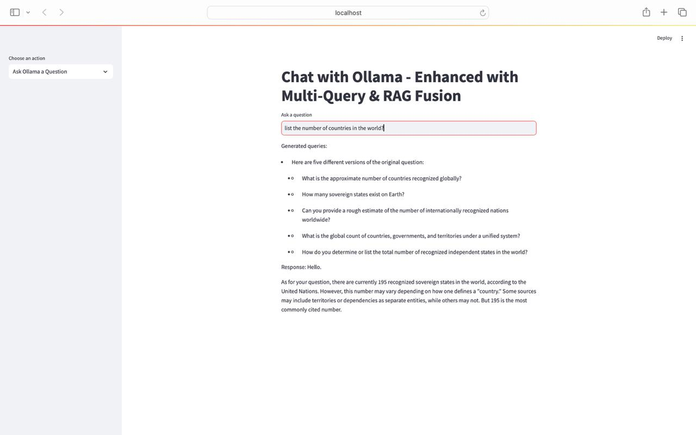

# AI Assistant for the Constitution of Kazakhstan

This project is an AI-powered assistant that answers questions related to the **Constitution of the Republic of Kazakhstan** using **Retrieval-Augmented Generation (RAG)** and MongoDB vector search.

## Features

- **Multi-query generation** for improved document retrieval
- **RAG Fusion** for better answer relevance
- **Integration with Large Language Models (LLMs)** (Ollama)
- **Chat functionality** using Streamlit
- **File upload support** (single and multiple files)
- **Stores query and response history** in MongoDB
- **Web scraping** for fetching the latest Constitution text
- **Summary generation** of constitutional content

## Installation

### Prerequisites
Ensure you have **Python 3.10+** installed and MongoDB running locally (`mongodb://localhost:27017/`).

### Step 1: Clone the Repository
```bash
git clone https://github.com/your-username/chat-4.git
cd chat-4
```

### Step 2: Install Dependencies
```bash
pip install -r requirements.txt
```

### Step 3: Run the Application
```bash
streamlit run app.py
```

## Usage

### 1. Show Documents in MongoDB
- View all stored legal documents in the database.

### 2. Add a New Document to MongoDB
- Manually input text or upload `.txt` files.

### 3. Upload File and Ask a Question
- Upload one or multiple `.txt` files and ask questions about their content.

### 4. Ask Ollama a Question
- Input a query and receive AI-generated answers based on stored documents.

### 5. Ask a Question About the Constitution
- Automatically fetches and processes the Constitution of Kazakhstan.
- Generates a summary of relevant articles.

### 6. View Chat History
- Displays previously asked questions and responses.

## Example Queries
```markdown
- "What are the rights of Kazakhstani citizens?"
- "How does the Constitution define the role of the President?"
- "What is stated about freedom of speech?"
```

## Screenshots




## File Upload Feature
- Supports `.txt` file uploads.
- Parses and indexes documents for retrieval.
- Multi-file support for batch processing.

## Tech Stack
- **Frontend**: Streamlit
- **Backend**: Python, LangChain, Sentence Transformers
- **Database**: MongoDB (Vector Store)
- **LLM**: Ollama
- **Web Scraping**: BeautifulSoup

## Project Structure
```bash
chat-4/
│── app.py               # Main Streamlit application
│── requirements.txt      # Python dependencies
│── README.md             # Project documentation
```

## License
This project is licensed under the **MIT License**. See [LICENSE](LICENSE) for details.


